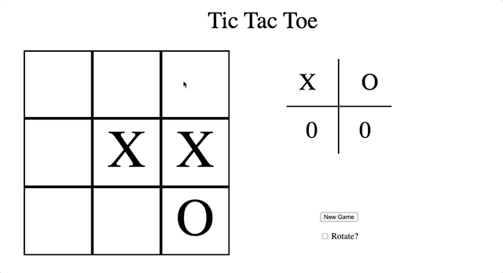
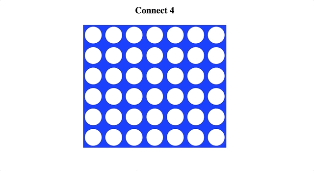

# Mini-Apps

A collection of small game apps

## Table of Contents

1. [Tic-Tac-Toe](#Tic-Tac-Toe)
2. [Connect Four](#Connect)

## Tic-Tac-Toe
HTML, CSS, JavaScript, Express

From tic-tac-toe file:
1. `npm install`
2. Serve tic-tac-toe at http://localhost:3000: `npm run start`

## Connect Four

HTML, CSS, JavaScript, Express, React, Webpack, Babel

From connect-four file:
1. `npm install`
2. Run webpack with `npm run react-dev`
3. Serve connect four at http://localhost:3000: `npm run start`